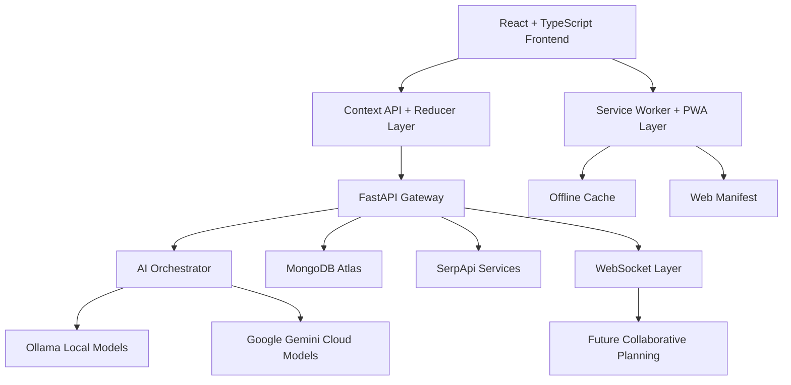

# 🌍 EeezTrip — Premium AI-Powered Travel Intelligence Platform

> **Mood-Driven. AI-Orchestrated. Weather-Aware.**
>
> *EeezTrip transforms traditional trip planning into an intelligent, immersive, and adaptive travel experience using hybrid AI orchestration, real-time pricing intelligence, and offline-first progressive web technologies.*

---

## 📌 Overview

**EeezTrip** is a next-generation AI-powered travel planning platform designed to generate personalized itineraries based on a user's **mood**, **budget**, **travel style**, **weather conditions**, and **real-time travel constraints**.

Unlike conventional travel aggregators, EeezTrip introduces a **Mood Discovery Engine** combined with a **Hybrid AI Reasoning Layer** capable of dynamically generating immersive day-by-day travel plans with contextual recommendations, adaptive alternatives, and cost-aware optimization.

The platform is architected using a **decoupled frontend-backend AI orchestration model**, enabling seamless extensibility, model swapping, and future distributed collaboration capabilities.

---

# ✨ Core Features

## 🚀 AI Itinerary Engine

### Dynamic Multi-Day Planning
- Generates **2–14 day itineraries** dynamically.
- Supports:
  - Solo travel
  - Group planning
  - Couples itineraries
  - Family optimization
  - Multi-city route generation

### Intelligent Cost Breakdown
- Real-time budget estimation for:
  - Flights
  - Hotels
  - Food
  - Local transport
  - Activities

### Contextual “Cozy Tips”
AI-generated experiential suggestions such as:
- Hidden cafés
- Sunset viewpoints
- Local cultural experiences
- Crowd-avoidance strategies
- Safety-aware recommendations

### Deep Mode Reasoning
Advanced reasoning mode for:
- Complex travel constraints
- Multi-destination optimization
- Time-window balancing
- Budget prioritization
- Transportation dependency resolution

---

## 🎭 Mood Discovery Engine

A visually immersive “Vibe-Based” recommendation system.

### Supported Moods

| Mood | Planning Behavior |
|---|---|
| Relaxed | Low-density, scenic itineraries |
| Adventure | Activity-heavy exploration |
| Romantic | Private & aesthetic experiences |
| Foodie | Culinary-focused recommendations |
| Explorer | Landmark + cultural balancing |
| Luxury | Premium accommodation prioritization |

### Technical Highlights
- Emotion-oriented prompt engineering
- AI-generated activity weighting
- Personalized destination ranking
- Dynamic UI adaptation via Context-driven rendering

---

## 🌦 Weather-Aware Travel Intelligence

EeezTrip incorporates adaptive planning using environmental context.

### Features
- Detects:
  - Rain
  - Heatwaves
  - Extreme weather conditions
- Automatically:
  - Reorders activities
  - Suggests indoor alternatives
  - Optimizes commute timing
  - Minimizes weather disruption

### Architectural Benefit
The weather logic exists as a **middleware planning layer**, enabling:
- Modular replacement
- API provider abstraction
- Future predictive forecasting support

---

## 🎙 Voice Concierge Interface

Integrated voice-to-planner interaction using the **Web Speech API**.

### Capabilities
- Voice-driven itinerary form filling
- Natural language destination capture
- Conversational interaction flow
- Accessibility-oriented navigation

### Future Extensibility
Current architecture supports:
- Multi-language voice models
- Real-time conversational agents
- Streaming speech synthesis
- AI travel assistant avatars

---

## 💸 Real-Time Pricing Aggregation

Integrated pricing intelligence using **SerpApi**.

### Aggregated Data Sources
- Flights
- Hotels
- Ride services
- Tourist attraction estimates

### Technical Design
Pricing modules are implemented as:
- Provider-isolated services
- Rate-limit-aware adapters
- Async fetch pipelines via FastAPI

This abstraction allows future integration with:
- Amadeus APIs
- Skyscanner APIs
- Booking engines
- Airline direct APIs

---

# 🏗 High-Level Architecture



---

# 🧠 AI Strategy — Hybrid Local/Cloud Architecture

## Hybrid Orchestration Model

EeezTrip uses a **dual-model AI architecture**:

| AI Layer | Responsibility |
|---|---|
| Ollama (Local LLMs) | Privacy-sensitive reasoning & low-latency generation |
| Google Gemini | Complex cloud reasoning & deep contextual planning |

---

## Why Hybrid AI?

### 🔒 Privacy-Aware Computation
Local LLM execution via Ollama enables:
- Reduced cloud dependency
- Better user privacy
- Offline-capable intelligence
- Lower inference costs

### ☁ Cloud-Augmented Reasoning
Gemini is selectively used for:
- Long-context planning
- Complex optimization
- Advanced semantic reasoning
- Constraint-heavy itinerary generation

### 🔁 Model Agnostic Architecture
The frontend is intentionally **decoupled from model implementations**.

Benefits:
- Swap AI models without UI changes
- Support future open-source LLMs
- Add domain-specific fine-tuned models
- Enable enterprise deployment flexibility

---

# ⚛ Frontend Engineering

## React 18 + TypeScript + Vite

### Why This Stack?

| Technology | Purpose |
|---|---|
| React 18 | Concurrent rendering & scalable UI |
| TypeScript | Type safety & maintainability |
| Vite | High-speed bundling & HMR |

---

## 🎨 UI/UX System

### Tailwind CSS + Glassmorphism
The interface uses:
- Layered translucent panels
- Blur-based depth rendering
- Micro-interaction animations
- Adaptive responsive layouts

### UX Philosophy
EeezTrip focuses on:
- Reduced cognitive load
- Emotional engagement
- Mobile-first interaction
- Conversational navigation

---

# 🔄 State Management Architecture

## Context API + Reducer Pattern

EeezTrip implements action-driven state management.

```ts
dispatch({
  type: "GENERATE_ITINERARY",
  payload: itineraryData
});
```

---

## Why Reducers Instead of Simple State?

### Predictable State Transitions
Reducers provide:
- Immutable updates
- Deterministic state flow
- Easier debugging
- Better scalability

### Future Collaboration Readiness
The reducer architecture is intentionally aligned toward:
- CRDT-based synchronization
- Operational transforms
- Multi-user collaborative planning
- Real-time shared itineraries

This makes the current architecture **future-proof** rather than prototype-oriented.

---

# 🗄 Backend Architecture

## FastAPI + Async Python

### Core Benefits
- High-performance asynchronous APIs
- Native async/await support
- Automatic OpenAPI documentation
- Strong validation using Pydantic

---

## MongoDB Atlas + Motor Driver

### Why MongoDB?
Travel planning data is:
- Deeply nested
- Dynamic
- Schema-flexible
- AI-generated

MongoDB provides:
- Flexible document structures
- Horizontal scalability
- Efficient itinerary storage

### Async Motor Driver
Motor enables:
- Non-blocking database operations
- Scalable concurrent requests
- Improved API responsiveness

---

# 🔎 RAG Readiness & Knowledge Grounding

EeezTrip includes foundational architecture for future **Retrieval-Augmented Generation (RAG)** workflows.

## Current Readiness
The platform is designed to support:
- Vector embeddings
- Semantic destination search
- Grounded travel recommendations
- Fact-verified itinerary generation

## Planned Vector Stack
Potential integrations:
- Pinecone
- Weaviate
- ChromaDB
- FAISS

### Why This Matters
RAG reduces:
- AI hallucinations
- Outdated travel advice
- Inaccurate recommendations

while improving:
- Trustworthiness
- Personalization
- Explainability

---

# 📱 PWA & Edge Computing Strategy

## Progressive Web App (PWA)

EeezTrip is designed as an **offline-first travel companion**.

### Features
- Installable application
- Offline itinerary access
- Cached assets & plans
- Native-like experience

---

## Service Worker Architecture

### Current Capabilities
- Static asset caching
- API response caching
- Background synchronization
- Offline fallbacks

### Edge Computing Benefits
The Service Worker layer enables:
- Reduced latency
- Lower bandwidth usage
- Faster repeat visits
- Travel accessibility in low-network zones

---

# 🔌 Real-Time Collaboration Readiness

## WebSocket-Ready Infrastructure

The backend is architected for:
- Live itinerary synchronization
- Shared group planning
- Concurrent updates
- Event-driven travel coordination

### Future CRDT Integration
Planned architecture evolution:
- Conflict-free collaborative editing
- Distributed synchronization
- Offline merge resolution
- Multi-device planning continuity

---

# ⚙️ Installation & Setup

## 1️⃣ Clone Repository

```bash
git clone https://github.com/your-username/eeeztrip.git

cd eeeztrip
```

---

## 2️⃣ Frontend Setup

```bash
cd frontend

npm install

npm run dev
```

### Frontend Stack
- React 18
- TypeScript
- Tailwind CSS
- Vite

---

## 3️⃣ Backend Setup

```bash
cd backend

python -m venv venv
```

### Activate Environment

#### Windows
```bash
venv\Scripts\activate
```

#### Linux / macOS
```bash
source venv/bin/activate
```

### Install Dependencies

```bash
pip install -r requirements.txt
```

### Run FastAPI Server

```bash
uvicorn app.main:app --reload
```

---

## 4️⃣ MongoDB Configuration

Create a `.env` file:

```env
MONGODB_URI=your_mongodb_connection
GEMINI_API_KEY=your_api_key
SERPAPI_API_KEY=your_api_key
```

---

## 5️⃣ Ollama Setup

### Install Ollama

```bash
https://ollama.com/download
```

### Pull Model

```bash
ollama pull llama3
```

### Run Local Model

```bash
ollama run llama3
```

---

# 📂 Suggested Project Structure

```bash
EeezTrip/
│
├── frontend/
│   ├── src/
│   ├── components/
│   ├── contexts/
│   ├── reducers/
│   ├── services/
│   └── hooks/
│
├── backend/
│   ├── app/
│   ├── api/
│   ├── services/
│   ├── ai/
│   ├── websocket/
│   └── models/
│
└── docs/
```

---

# 📈 Future Scope

## 🔹 Short-Term Goals
- AI budget optimization engine
- Dynamic itinerary regeneration
- Enhanced weather forecasting
- AI travel chat assistant

---

## 🔹 Mid-Term Goals
- Real-time collaborative planning
- CRDT synchronization layer
- Vector database integration
- Multi-language voice concierge

---

## 🔹 Long-Term Vision
- Autonomous AI travel agents
- Predictive behavioral travel modeling
- AR-assisted smart tourism
- Edge AI offline trip intelligence
- AI-powered travel ecosystem marketplace

---

# 📊 Engineering Principles

| Principle | Implementation |
|---|---|
| Scalability | Async FastAPI + MongoDB |
| Maintainability | TypeScript + Modular Services |
| Extensibility | Decoupled AI orchestration |
| Reliability | Reducer-driven predictable state |
| Accessibility | Voice-first interaction |
| Resilience | Offline-first PWA strategy |

---

# 🛡 Security Considerations

- Environment-based secret management
- Async request isolation
- Provider abstraction layers
- API key compartmentalization
- Future JWT authentication readiness

---

# 📄 License

Licensed under the **MIT License**.

```text
MIT License © 2026 EeezTrip
```

---

# 🌟 Closing Statement

EeezTrip is not merely a travel planner—it is an extensible AI-native platform engineered around adaptive intelligence, modular orchestration, and resilient distributed architecture.

Its current implementation intentionally lays the foundation for:
- collaborative AI systems,
- grounded reasoning pipelines,
- edge-assisted travel computation,
- and next-generation personalized tourism experiences.

The project demonstrates how modern full-stack engineering, asynchronous backend systems, hybrid AI architectures, and progressive web technologies can converge into a scalable real-world intelligent application.
